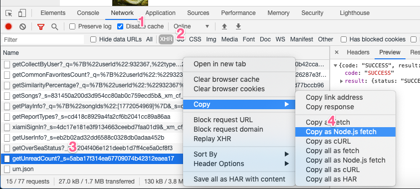

# Xiami Exporter

导出虾米音乐的个人数据，功能：
- [x] 导出收藏歌曲为 json
- [ ] 导出收藏艺人为 json
- [ ] 导出收藏专辑为 json
- [ ] 导出播放列表为 json (个人和收藏)
- [x] 将导出的数据整理至 sqlite 数据库
- [x] 下载已导出歌曲的 MP3 文件
- [ ] 根据导出信息为 MP3 添加完整的 ID3 tag
- [ ] 下载已导出的歌曲、专辑、艺人的封面图片

## Getting Started

1. Clone 项目，创建 Python 3 虚拟环境，安装所有依赖

   ```
   $ python -m venv venv
   $ source venv/bin/activate
   $ pip install -r requirements.txt
   ```

2. 在 Chrome 中登录虾米，点击 “我的音乐”，从 URL 中获取 user_id，例如 `https://www.xiami.com/user/932367`, user_id 即为 `932367`.
3. 运行 `python -m xiami_exporter.cli init`，根据提示，输入配置项，其中包括刚刚获取的 user_id.
4. 回到 Chrome “我的音乐” 页面，右键选择 “审查页面” (Inspect)，点击 “网络” (Network) 并在过滤器中选择 XHR，刷新页面，在最后一条带有 `_s` 的网络请求上点击右键，选择 “Copy - Copy as Node.js fetch”
  
5. 在项目目录下创建 fetch.py 文件，将刚才拷贝的内容粘贴进去并保存 (`pbpaste > fetch.py`)
6. 运行 `python -m xiami_exporter.cli check`, 显示成功表示可以使用导出功能，否则请重试上一步，或联系开发者
7. 根据想要导出的数据，运行相应指令，如 `python -m xiami_exporter.cli export-songs` 即导出收藏歌曲为 json

## Usage

运行方式为 `python -m xiami_exporter.cli COMMAND`, 可通过 `python -m xiami_exporter.cli --help` 查看指令列表。

### COMMAND: `init`

初始化配置文件

### COMMAND: `check`

检查 `fetch.py` 是否可以通过虾米 API 的验证，成功时输出如下:

```
test fetch() ok
recal token correct: be5bb12dbb135066f4cb282706019bc8
Success, you can now use the export commands
```

### COMMAND: `export-songs`

导出收藏歌曲为 json 文件，每页一个，文件名为 `song-<page_number>.json`，存放于 `XiamiExports/json/songs`

此指令是后续创建数据库、下载音乐的基础。

### COMMAND: `create-songs-db`

将收藏歌曲导入数据库中记录，此指令是 `download-music` 的基础。

### COMMAND: `download-music`

下载所有收藏歌曲，下载状态 (download_status) 会同步保存到数据库中。

中断后可重新运行，只会从数据库中筛选 download_status = NOT_SET 的歌曲进行下载。

> 注: 此指令后续会支持下载 album 和 playlist

## Hierarchy

Xiami Exporter 保存的数据有如下几类：
- json 数据文件: 歌曲、专辑、艺人、播放列表
- MP3 音频文件: 歌曲、专辑、播放列表
- jpg/png 图片文件: 专辑封面
- sqlite3 数据库文件: 歌曲、专辑、艺人、播放列表

默认在项目路径下创建 `XiamiExports` 目录，其文件系统结构大体如下:

```
XiamiExports/
  db.sqlite3
  json/
    songs/
      song-1.json
      song-2.json
      ...
    albums/
    playlists/
    artists/
  music/
    NUM-SONG_ID.mp3
  covers/
    ALBUM_ID.jpg
```

## Development

<details>
<summary><strong><code>Development notes, check if you have interests.</code></strong></summary>


other TODO
- [ ] remove useless keys in json

### tag problems

- arrangement -> TIPL, tried to save but cannot be displayed
- comment -> COMM, easyid3 writes as:
  ```
  COMM==XXX=artist_alias: あーりーれい
  ```

  which is not recognized by Meta.app.

  Meta.app writes as:
  ```
  COMM==ENG=first line
  second line
  COMM=ID3v1 Comment=eng=first line
  second line
  ```
- performers should be TMCL, but is written as TXXX:
  ```
  TXXX=PERFORMER=陽花
  ```

</details>
